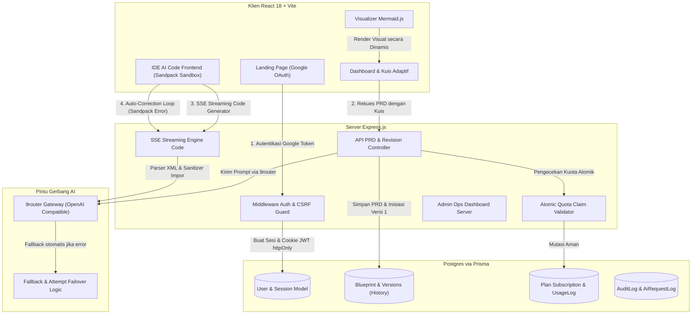
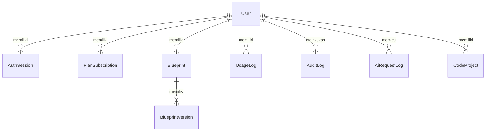
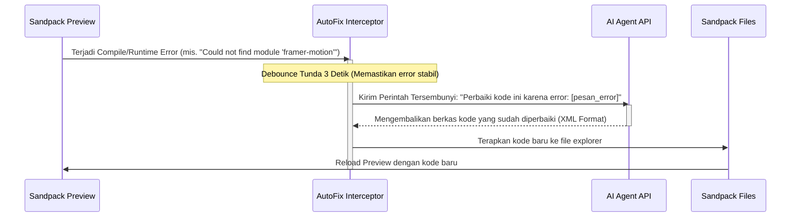

# Product Requirements Document (PRD)
## Sistem & Mekanisme VibeCoderz AI Architecture Engine

---

> [!NOTE]  
> Dokumen ini disusun secara mendalam untuk merinci mekanisme kerja, arsitektur data, komponen fitur, dan integrasi teknologi dari platform **VibeCoderz**. Dokumen ini dirancang sebagai panduan cetak biru *(blueprint)* teknis bagi tim pengembang yang ingin mereplikasi atau menerapkan sistem serupa pada proyek lain.

> [!IMPORTANT]
> Status implementasi repo saat ini bernama **AriseHash**. Stack aktual adalah React 18 + Vite di `app/`, Express + Prisma + Postgres di `server/`, dan Sandpack untuk prototipe frontend di browser. Workspace kode belum menjalankan backend/fullstack production runtime; fitur backend generator masih roadmap. Autentikasi aktual memakai Google OAuth, session JWT di cookie httpOnly, session database, dan header CSRF untuk request mutasi berbasis cookie.

---

## 1. Ikhtisar Produk (Product Executive Summary)

**VibeCoderz AI Architecture Engine** adalah platform SaaS *(Software as a Service)* bertenaga AI yang dirancang untuk mempercepat fase perencanaan infrastruktur aplikasi, desain sistem, dan pembuatan draf kode modular. Platform ini memangkas waktu perencanaan arsitektur perangkat lunak dari hitungan minggu menjadi hitungan detik.

### Variabel Masalah & Solusi
*   **Masalah:** Membuat Dokumen Spesifikasi Produk (PRD) dan arsitektur teknis (skema DB, diagram alir, keputusan *tech stack*) secara manual membutuhkan waktu yang lama dan rentan terhadap ketidakkonsistenan keputusan teknis.
*   **Solusi:** Pengguna cukup memasukkan ide kasar proyek mereka. Sistem akan menyajikan kuis adaptif dinamis berbasis konteks (Web3, AI, E-Commerce, dsb.) lalu AI akan merakit dokumen teknis PRD lengkap, diagram Mermaid.js interaktif, skema database, rencana instruksi coding (*Vibecoding Plan*), hingga merakit aplikasi React fungsional secara instan di dalam editor Sandpack terintegrasi di browser dengan fitur penanganan galat otomatis (*auto-correction loop*).

---

## 2. Arsitektur Teknologi & Sistem (System & Tech Stack)

Sistem menggunakan arsitektur *Monolith-ready decoupled* yang memadukan backend Node.js/Express, ORM Prisma, database Postgres, dan frontend berbasis React 18 + Vite.



### Rincian Tumpukan Teknologi (Tech Stack Detail)

| Layer | Teknologi Utama | Peran & Alasan Penggunaan |
| :--- | :--- | :--- |
| **Frontend Core** | React 18, JavaScript, Vite | Rendering UI SPA yang ringan dan cepat untuk MVP. |
| **Styling & Animation** | CSS variables, Framer Motion | Desain antarmuka premium dengan token CSS lokal, dark mode, dan micro-animation interaktif. |
| **Sandbox Runtime** | `@codesandbox/sandpack-react` | Menyediakan lingkungan pengembangan frontend instan langsung di browser untuk React/Vue/Svelte/Vanilla. |
| **Backend Core** | Node.js, Express.js | Kerangka server minimalis untuk routing API, penanganan SSE (Server-Sent Events), dan logika middleware keamanan. |
| **Database & ORM** | Prisma ORM & Postgres | Penyimpanan relasional untuk user, session, blueprint, chat, quota, audit log, dan project kode. |
| **Security Layer** | Google OAuth, JWT cookie httpOnly, CSRF header, CORS, Express Rate Limit | Melindungi login, session, request mutasi, dan endpoint AI mahal. |
| **AI Integration** | Fetch API ke endpoint OpenAI-compatible | Mengakses model AI multi-provider dengan fallback otomatis demi keandalan sistem *(failover)* tingkat tinggi. |

---

## 3. Struktur Folder & Sistem Berkas (Directory & File Structure)

Struktur repositori diatur secara logis untuk memisahkan logika server backend, ORM data, dan aplikasi frontend klien:

```text
Tools_PRD/
├── prisma/
│   └── schema.prisma            # Skema database & ORM (Prisma)
├── server/                      # Logika Backend Server (Express.js)
│   ├── routes/
│   │   ├── admin.ts             # Manajemen pengguna, riwayat AI, audit log (Admin)
│   │   ├── auth.ts              # Login Google Token, verifikasi JWT, cookie, CSRF
│   │   ├── blueprints.ts        # CRUD PRD Blueprint, ekspor berkas, duplikasi
│   │   ├── codeProjects.ts      # Simpan/Muat berkas proyek kode dari Sandpack
│   │   └── quota.ts             # Logika kuota harian & reset zona waktu Asia/Jakarta
│   └── utils/
│       ├── aiModels.ts          # Konfigurasi model AI & daftar fallback failover
│       ├── audit.ts             # Pencatatan audit sistem & log panggil AI
│       ├── blueprintVersions.ts # Manajemen versi dokumen (System Version Control)
│       ├── env.ts               # Validasi kelengkapan variabel lingkungan (.env)
│       └── validation.ts        # Utilitas parser tipe data input request body
├── src/                         # Logika Frontend (Vite + React)
│   ├── components/
│   │   ├── ui/                  # Komponen visual dasar (Bento grid, tombol, dsb.)
│   │   ├── BuildCode.tsx        # IDE AI, Parser Kode Streaming, Sandpack Preview, Auto-Fix
│   │   ├── Dashboard.tsx        # Dasbor utama, Kuis Adaptif, Mermaid Renderer, Templates
│   │   ├── LandingPage.tsx      # Landing page, integrasi login Google
│   │   ├── PillNav.tsx          # Navigasi melayang estetik
│   │   ├── PublicShare.tsx      # Halaman visualisasi blueprint publik (tanpa login)
│   │   └── Silk.tsx             # Efek background canvas bergelombang modern
│   ├── utils/
│   │   ├── api.ts               # Interseptor fetch API, penanganan token CSRF & error
│   │   └── prisma.ts            # Ekspor instance Prisma client tunggal (Singleton)
│   ├── App.tsx                  # Root Routing Frontend
│   └── index.css                # Konfigurasi gaya global
├── package.json                 # Konfigurasi dependensi npm
└── app.ts                       # Entrypoint aplikasi (Integrasi Server & SPA Client)
```

---

## 4. Skema Database Detail (Database Architecture)

Skema database dimodelkan menggunakan format relasional Prisma ORM. Implementasi repo saat ini memakai Postgres sebagai wadah penyimpanan default.



### Rincian Tabel Database (Prisma Schema Reference)

#### 1. Tabel `User`
Menyimpan informasi data identitas pengguna yang diautentikasi lewat Google OAuth.
*   `id` (String, UUID, Primary Key): Pengenal unik user.
*   `email` (String, Unique): Alamat email user.
*   `name` (String, Optional): Nama lengkap user.
*   `picture` (String, Optional): Tautan foto profil Google.
*   `googleId` (String, Unique, Optional): ID unik dari Google.
*   `role` (String, Default: "USER"): Akses kontrol tingkat pengguna (`USER`, `ADMIN`).
*   `createdAt` & `updatedAt` (DateTime): Waktu pembuatan dan pembaruan akun.

#### 2. Tabel `AuthSession`
Mengelola siklus aktif sesi login pengguna secara aman di sisi server.
*   `id` (String, UUID, Primary Key): ID token sesi.
*   `userId` (String, Foreign Key -> User): Pemilik sesi.
*   `revokedAt` (DateTime, Optional): Kapan sesi dicabut secara manual (logout).
*   `expiresAt` (DateTime): Batas kedaluwarsa sesi (7 Hari).

#### 3. Tabel `PlanSubscription`
Mengatur tingkat langganan pengguna beserta jatah kuota harian untuk fitur PRD dan Code.
*   `id` (String, UUID, Primary Key): ID langganan.
*   `userId` (String, Foreign Key -> User): Pemilik paket.
*   `planType` (String, Default: "FREE"): Jenis paket (`FREE`, `PRO`, `PRO_MAX`).
*   `status` (String, Default: "ACTIVE"): Status paket (`ACTIVE`, `EXPIRED`, `CANCELLED`).
*   `prdQuota` (Int, Default: 1): Limit harian untuk pemrosesan PRD.
*   `quotaUsedToday` (Int, Default: 0): Total kuota PRD yang telah terpakai hari ini.
*   `codeQuotaUsedToday` (Int, Default: 0): Total kuota kode AI yang telah terpakai hari ini.
*   `lastQuotaReset` (DateTime): Waktu terakhir kuota diset ulang (24 jam sekali).
*   `activeUntil` (DateTime, Optional): Batas masa aktif paket.

#### 4. Tabel `Blueprint`
Menyimpan draf dokumen PRD / Arsitektur yang dihasilkan oleh AI.
*   `id` (String, UUID, Primary Key): ID berkas blueprint.
*   `userId` (String, Foreign Key -> User): Pemilik dokumen.
*   `name` (String): Nama proyek dokumen.
*   `type` (String): Jenis aplikasi proyek (mis. Fullstack Web App).
*   `content` (String): Konten Markdown dokumen PRD.
*   `isPublic` (Boolean, Default: false): Status publikasi dokumen.
*   `shareToken` (String, Unique, Optional): Token acak 16 byte untuk akses pratinjau publik.
*   `shareExpiresAt` (DateTime, Optional): Masa berlaku token publik (default 30 hari).
*   `shareViewCount` (Int, Default: 0): Frekuensi dokumen diakses secara publik.
*   `folder` (String, Optional): Kategori folder pengelompokan.
*   `tagsJson` (String, Default: "[]"): Array tag penanda (disimpan sebagai stringified JSON).
*   `currentVersion` (Int, Default: 1): Nomor versi terkini.

#### 5. Tabel `BlueprintVersion`
Menyimpan riwayat snapshot *(version history)* dari setiap revisi blueprint.
*   `id` (String, UUID, Primary Key): ID versi.
*   `blueprintId` (String, Foreign Key -> Blueprint): Referensi blueprint terkait.
*   `userId` (String): Aktor pembuat revisi.
*   `version` (Int): Angka nomor versi berurutan.
*   `name` (String): Nama judul versi snapshot.
*   `content` (String): Konten isi PRD versi terkait.
*   `source` (String, Default: "MANUAL"): Sumber perubahan (`GENERATE`, `MANUAL_EDIT`, `AI_REVISE`, `RESTORE`, `BACKFILL`).

#### 6. Tabel `CodeProject`
Menyimpan berkas-berkas proyek koding dalam satu JSON besar untuk dimuat kembali di Sandpack.
*   `id` (String, UUID, Primary Key): ID proyek kode.
*   `userId` (String, Foreign Key -> User): Pemilik proyek.
*   `name` (String): Nama aplikasi proyek koding.
*   `filesJson` (String): Seluruh data file Sandpack (`Record<path, {code}>`) dalam bentuk JSON string.
*   `messagesJson` (String): Riwayat percakapan AI pengembang dalam format JSON string.

#### 7. Tabel `AuditLog` & `AiRequestLog`
Pencatatan riwayat audit keamanan sistem serta pelacakan performa & kegagalan koneksi API AI.

---

## 5. Mekanisme Inti Sistem (Core Architectural Mechanisms)

Bagian ini memaparkan secara mendalam 5 mekanisme teknis utama VibeCoderz yang dapat direplikasi langsung ke proyek sistem perangkat lunak lainnya.

### A. Mekanisme Klaim Kuota Atomik (Atomic Quota Claim)
Untuk mencegah eksploitasi di mana pengguna mengirimkan banyak request secara paralel sebelum database merekam perubahan kuota *(double spending)*, VibeCoderz menerapkan klaim kuota secara atomik menggunakan query kondisional di database.

```typescript
// Kutipan logika dari file server/routes/quota.ts
export async function claimQuota(userId: string, kind: QuotaKind) {
  const sub = await getActiveSubscription(userId);
  if (!sub) return { allowed: false, remaining: 0, limit: 0, planType: 'NONE', subscriptionId: '' };

  const limit = getQuotaLimit(sub.planType, kind);
  const field = kind === 'prd' ? 'quotaUsedToday' : 'codeQuotaUsedToday';
  const usedToday = kind === 'prd' ? sub.quotaUsedToday : sub.codeQuotaUsedToday;

  if (usedToday >= limit) {
    return { allowed: false, remaining: 0, limit, planType: sub.planType, subscriptionId: sub.id };
  }

  // Atomik update: pastikan mutasi baris data hanya berjalan jika nilai kuota terpakai masih di bawah batas limit
  const updatedCount = await prisma.planSubscription.updateMany({
    where: {
      id: sub.id,
      [field]: { lt: limit }, // HANYA perbarui bila nilai saat ini < limit
    },
    data: {
      [field]: { increment: 1 }, // Lakukan operasi penambahan (increment) langsung di database
    },
  });

  if (updatedCount.count === 0) {
    // Gagal mengupdate berarti ada transaksi paralel lain yang telah mendahului dan menghabiskan sisa kuota
    const fresh = await prisma.planSubscription.findUnique({ where: { id: sub.id } });
    const freshUsed = kind === 'prd' ? fresh?.quotaUsedToday ?? limit : fresh?.codeQuotaUsedToday ?? limit;
    return { allowed: false, remaining: Math.max(0, limit - freshUsed), limit, planType: sub.planType, subscriptionId: sub.id };
  }

  return { allowed: true, remaining: Math.max(0, limit - usedToday - 1), limit, planType: sub.planType, subscriptionId: sub.id };
}
```

*   **Pola Pengembalian Kuota (Refund):** Jika pemanggilan AI eksternal gagal di tengah jalan setelah kuota terpotong, sistem memicu fungsi `refundQuota` untuk mendepresiasi kembali pemakaian kuota pengguna di blok `catch` demi kepuasan pengguna.

---

### B. Parser Kode Streaming & Pengecekan Keamanan Sandpack
Proses generasi kode React dilakukan secara langsung (*live-typing*) ke dalam file explorer Sandpack menggunakan format tag kustom XML. Backend mengirimkan data chunk melalui SSE, lalu frontend mem-parsing file secara real-time.

```text
Format Output AI:
<vcFile path="/App.tsx">
import React from 'react';
export default function App() { return <h1>Aplikasi</h1> }
</vcFile>
```

#### Langkah Kerja Parser di Klien (`BuildCode.tsx`):
1.  **Buffer Penyangga:** Karakter streaming yang masuk dikumpulkan ke dalam variabel penampung string.
2.  **Ekstraksi Berkas regex:** Regex global mencari pola `<vcFile path="(.+?)">([\s\S]*?)(?:<\/vcFile>|$)` untuk mendeteksi nama file dan isi kodenya.
3.  **Sanitisasi & Sandbox Guard:**
    *   Sistem mem-filter folder sistem ilegal (`/server/`, `/node_modules/`, `/prisma/`).
    *   Mengecek dependensi ilegal: Impor di luar library dasar (`react`, `react-dom`, `lucide-react`, `framer-motion`, `clsx`) akan dihapus baris kodenya agar Sandpack tidak gagal melakukan kompilasi akibat dependensi yang tidak terunduh.
    *   Memastikan template index berkas Vite tetap memiliki tag inisiasi `<div id="root"></div>` serta menyuntikkan skrip CDN Tailwind CSS `<script src="https://cdn.tailwindcss.com"></script>` secara paksa agar class visual rendering berjalan semestinya.

---

### C. Loop Koreksi Otomatis Sandpack (Auto-Correction Loop)
Jika aplikasi yang di-generate AI menghasilkan galat kompilasi atau kesalahan runtime, Sandpack menangkap pesan error tersebut dan secara otomatis mengirimkan pesan tersembunyi ke AI untuk memperbaikinya tanpa campur tangan pengguna.



*   **Pola Debounce:** Fungsi auto-fix ditunda selama 3 detik setelah pesan error tertangkap. Hal ini berguna untuk menghindari *infinite API loop request* selagi sistem sedang memproses rendering normal.

---

### D. Optimasi Memori AI & Prompt Caching untuk Revisi Dokumen
Dokumen PRD memiliki ukuran token yang besar (bisa mencapai 3000-5000 token). Mengirim ulang seluruh isi PRD setiap kali pengguna melakukan revisi kecil akan menghabiskan batas TPM *(Tokens Per Minute)* dan membebani biaya API.

#### Mekanisme Context Pruning:
1.  Frontend/Backend menyaring bagian dokumen PRD. Hanya header utama (`#`, `##`, `- `) yang diekstraksi untuk memetakan kerangka outline struktur PRD (berfungsi sebagai cached summary, memangkas data hingga 70%).
2.  Sistem menyusun prompt gabungan: `Kerangka Outline PRD (Cached) + Konten 6000 karakter terdekat + Instruksi Revisi Pengguna`.
3.  Ini memastikan AI memahami konteks dokumen besar dengan konsumsi token minimum.

---

### E. Manajemen Versi Snapshot via Prisma/Postgres
Ketika dokumen PRD disimpan atau diubah, sistem mencatat versi terbarunya. Untuk menghindari pembacaan versi ganda saat ada request bersamaan, nomor versi dihitung langsung oleh database saat baris data baru ditambahkan.

```sql
-- Query atomik dari server/utils/blueprintVersions.ts
INSERT INTO BlueprintVersion (id, blueprintId, userId, version, name, content, source, createdAt)
SELECT
  $1,                     -- UUID acak
  $2,                     -- Blueprint ID
  $3,                     -- User ID
  COALESCE(MAX(version), 0) + 1, -- Cari versi tertinggi secara atomik lalu tambahkan 1
  $4,                     -- Judul versi
  $5,                     -- Konten isi
  $6,                     -- Sumber aksi
  $7                      -- Waktu sekarang
FROM BlueprintVersion
WHERE blueprintId = $2;
```

---

## 6. Panduan Penerapan (Replication Guide)

Jika Anda ingin menerapkan arsitektur VibeCoderz di proyek perangkat lunak baru Anda, ikuti langkah-langkah sistematis berikut:

### Langkah 1: Setup Keamanan Auth & Sesi
1.  Instal `@react-oauth/google` di frontend untuk memunculkan modal login Google secara instan.
2.  Di backend, terima token JWT ID dari frontend, lakukan prapemrosesan fetch ke endpoint Google (`https://oauth2.googleapis.com/tokeninfo?id_token=...`) untuk memvalidasi identitas user.
3.  Simpan sesi di database dengan masa berlaku, buat JWT token berisi ID sesi dan CSRF token.
4.  Kirim JWT token sebagai cookie berlabel `httpOnly` dan set cookie CSRF agar dapat dibaca JavaScript.
5.  Buat middleware otentikasi backend untuk memvalidasi CSRF token pada setiap request bertipe mutasi (POST, PUT, DELETE) dengan mencocokkan header `x-csrf-token` dengan token yang terenkripsi di dalam cookie JWT.

### Langkah 2: Setup Database & Klaim Kuota
1.  Gunakan skema Prisma dengan relasi `User`, `PlanSubscription`, dan `UsageLog`.
2.  Salin fungsi `claimQuota` di atas ke file utilitas backend Anda. Pastikan setiap endpoint AI melakukan klaim kuota sebelum memproses input, dan lakukan `refundQuota` jika proses AI mengalami kegagalan.

### Langkah 3: Integrasi AI Fallback (Failover Loop)
1.  Ketika memanggil API AI, jangan hanya mendefinisikan satu model. Daftarkan array opsi percobaan (misalnya `[Model_Premium, Model_Fallback_Cepat, Model_Cadangan_Murah]`).
2.  Lakukan loop percobaan prapemanggilan. Jika model pertama gagal karena rate limit atau masalah jaringan, secara otomatis tangkap errornya dan segera alihkan panggilan ke model berikutnya di dalam daftar percobaan sebelum memberikan respons error ke pengguna.

### Langkah 4: Setup Lingkungan Sandpack & Parser Klien
1.  Pasang paket NPM `@codesandbox/sandpack-react` di React frontend Anda.
2.  Buat komponen wrapper yang memiliki objek status `files` untuk menyimpan struktur file Sandpack.
3.  Buat parser regex pada event penerimaan chunk SSE dari backend untuk secara dinamis memperbarui state file Sandpack.
4.  Tambahkan komponen interseptor Sandpack error untuk menangkap pesan error kompilasi dan hubungkan ke fungsi pemanggilan instruksi perbaikan AI secara otomatis.

---

## 7. Penutup & Rekomendasi
Sistem AriseHash membuktikan bahwa integrasi sandbox frontend terisolasi di sisi browser (Sandpack) yang dipadukan dengan agen AI penanganan galat mandiri menghasilkan pengalaman pengguna yang dinamis. Skema kuota atomik serta versioning berbasis Prisma/Postgres menjaga integritas data saat platform diakses secara konkuren oleh banyak pengguna.
